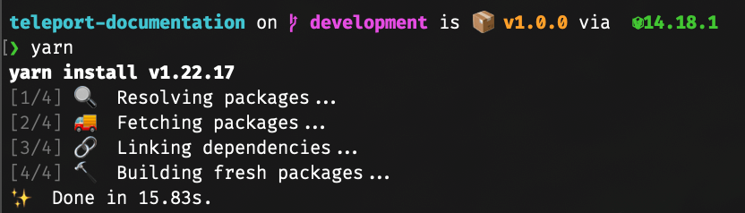
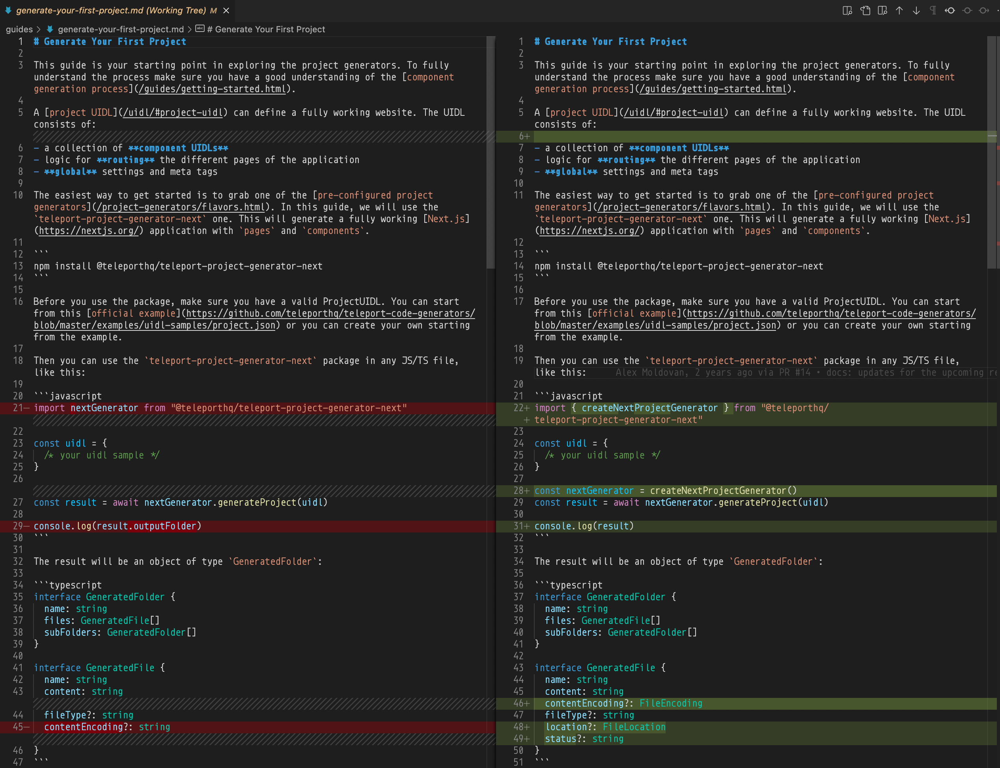
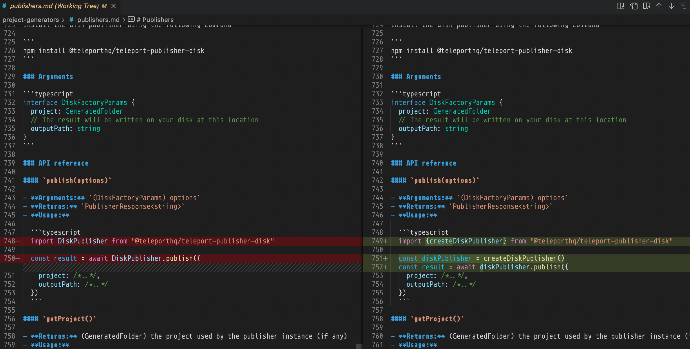
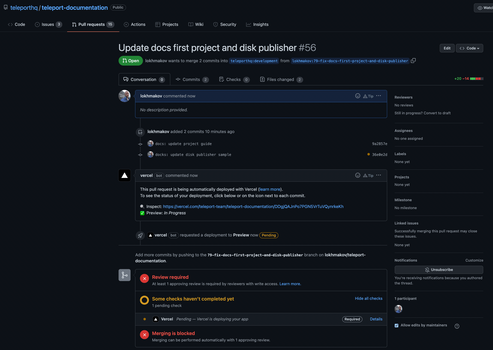

# Fix docs first project and disk publisher

79-fix-docs-first-project-and-disk-publisher

## SUMMARY

- [ ] REVIEW PR

https://github.com/teleporthq/teleport-documentation/pull/56

## BRIEF

- [x] GitHub fork teleport-documentation
- [x] SETUP repo
- [x] FIX
- [x] CHECK
- [x] PR

## SETUP repo

```
git clone git@github.com:lokhmakov/teleport-documentation.git
cd teleport-documentation
git checkout -b 79-fix-docs-first-project-and-disk-publisher
yarn
```



## SETUP ignore local history without .gitignore

echo .history >> .git/info/exclude

## docs: update project guide

- [x] FIX Guide generate-your-first-project wrong import
- [x] FIX Guide generate-your-first-project console.log outputFolder is wrong

// guides/generate-your-first-project.md



```sh
git add . && git commit -m "docs: update project guide"
```

## docks: update disk publisher sample

// project-generators/publishers.md



```sh
git add . && git commit -m "docks: update disk publisher sample"
git push --set-upstream origin 79-fix-docs-first-project-and-disk-publisher
```

## PR



Vercel: https://vercel.com/teleport-team/teleport-documentation/DDgjQAJnPo7PGN5VrTuVQynrkeKh

## CHECK [SUCCESS]

- [x] https://teleport-documentation-bi8xusr85-teleport-team.vercel.app/guides/generate-your-first-project.html
- [x] https://teleport-documentation-bi8xusr85-teleport-team.vercel.app/project-generators/publishers.html#disk
